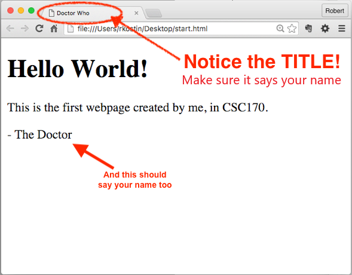

# Lab 1: Account Setup
*Due: Monday, May 18, 2020 (today)* 

Your assignment is to create an account on our class web server and practice the steps to create and upload files to the World Wide Web.

## Step 1: Create an FTP account

Your **FTP (File Transfer Protocol) account** is what you will use to copy your web files to the class web server throughout the semester.  The professor will set it up for you and send your login credentials to you via DM in Slack.

- [ ] In Slack, send the professor a DM with your UR username (e.g. rkostin) and a new/made-up password
  - Do *not* share your usual/favorite password with the professor!  Create a new password that isn't used anywhere else

- [ ] Watch Slack; the professor will reply to your DM with your FTP login information that you'll need to keep handy for the rest of the semester

If the professor doesn't get back to you immediately with your login information, you may proceed to Step 2 while you wait...

## Step 2: Create a simple webpage and view it in a web browser

On your desktop (or anywhere on your computer’s file system including a thumb drive ...which might be a good idea) create a new HTML file.

*NOTE: before proceeding, make sure your computer's operating system is showing "file extensions."  If you don't know what that is or how to turn them on, ask about it in the #help channel in Slack.*

Create your first HTML file...

- [ ] On a PC
  - Right mouse-click anywhere on the desktop and select “New” and then “Text Document”
  - Change the full name of the document from New Text Document.txt (including the extension) to: **start.html**
  - Click Yes to the warning dialog that pops-up.
  - Using a code editor (like [Sublime Text](https://www.sublimetext.com/3)), open the **start.html** file.
- [ ] On a Mac
  - Open a code editor (like [Sublime Text](https://www.sublimetext.com/3))
  - Save the current (empty) file to the desktop using the filename: **start.html**
- [ ] In your code editor, enter the following text exactly as shown below
  - Mimic the indentations using tabs or spaces (it doesn’t matter which you use - just try to line-up the text as shown)
  - Where it says “Enter Your Name” (in two places), enter *your* name
  - Note: the "h1" is the letter "h" and the number "1", not a lowercase L
  - Also note: you need ALL the code below, starting with the `<!doctype...` thing at the top...

```html
<!doctype html>

<html>

	<head>
		<meta charset="utf-8">
		<title>Enter Your Name</title>
	</head>

	<body>
		<h1>Hello World!</h1>
		<p>This is the first webpage created by me, in CSC 170.</p>
		<p>- Enter Your Name</p>
	</body>

</html>
```

- Save the file  
- Open the **start.html** file in a web browser (double click it).  You should see something like this...<br>

If there are problems, check your handiwork for mistakes in the code editor.  Then re-save and refresh the web browser.

If it all looks good, close the code editor and web browser before continuing.

## Step 3: Access your FTP account using FTP Software

You will copy your **start.html** file from your computer to the class web server by "FTP-ing" it using software that must be installed on your computer.  There are lots of kinds of FTP software you can use.  If you already know about this and have your own preference, you can use it.  Else, if it doesn't matter:

- Use **WinSCP** for Windows
- Use **Cyberduck** for Mac

To install your own: **WinSCP** (Windows only) go to [winscp.net/eng/download.php](http://winscp.net/eng/download.php)<br>...then click the green button, “DOWNLOAD WINSCP...”

After you install WinSCP, open it

- In WinSCP, click the New Site button to create a new session
- Change the File protocol to “FTP”
- In the Host name field, User name field and Password field, enter the FTP server information that you wrote down in Step 1.
- Ensure the Port number is set to “21”
- Click the Login button OR If you’re using your own computer: click the Save button, then Login

To install **Cyberduck** go to: [cyberduck.io](http://cyberduck.io)<br>
...then click “Download,” for Windows or OS X

After you install Cyberduck, open it

- In Cyberduck, click the Open Connection button
- In the Server field, Username field and Password field, enter the FTP server information that you wrote down in Step 1.
- Click Connect

If you were successful, your FTP client will connect you to the file space on the web server where you will put your web files.  Any files in that space will be accessible on the Web.

## Step 4: Upload and check your HTML document

- [ ] In the file system of your computer (e.g. on the Desktop - or wherever you're working), find your **start.html** file into and drag it the open FTP window to upload it to your account on the web server.

- Open a web browser and go to this web address, below, where “*username*” is the username that you created in Step 1 (example: **rkostin** -- *not* your FTP login with the @...)

   `www.csc170.org/username/start.html`

If you did everything correctly, you should see your simple webpage with your name on it. 

## Step 5: Log your work in Blackboard
In our CSC 170 area in **Blackboard**, in the Lab 1 assignment, create a submission where you will post *a link* to your webpage (not the actual file) to receive credit for this Lab.  

- [ ] Click the "Write Submission" button then paste your link in the box that appears. (Do not upload the HTML file to Blackboard.)
